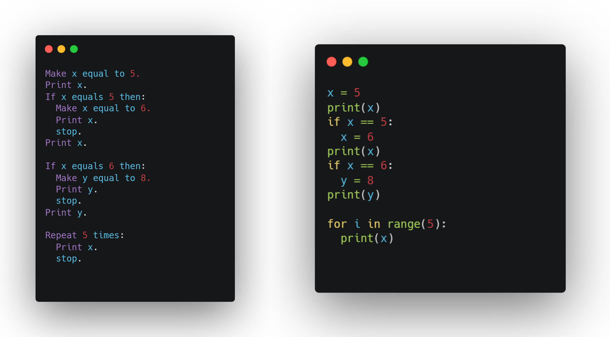

Created a programming language with Ruby.  

The goal of the project was for the language to be used in a way that mimics how someone would explain code in "pseudocode-like" terms.  
The English language has plenty of examples when it comes to expressing similar ideas with drastically different sentences and words.

Examples of things we had to do include creating syntax using Backus-Naur form and building tools for saving variables, creating functions, and member functions of data types.

