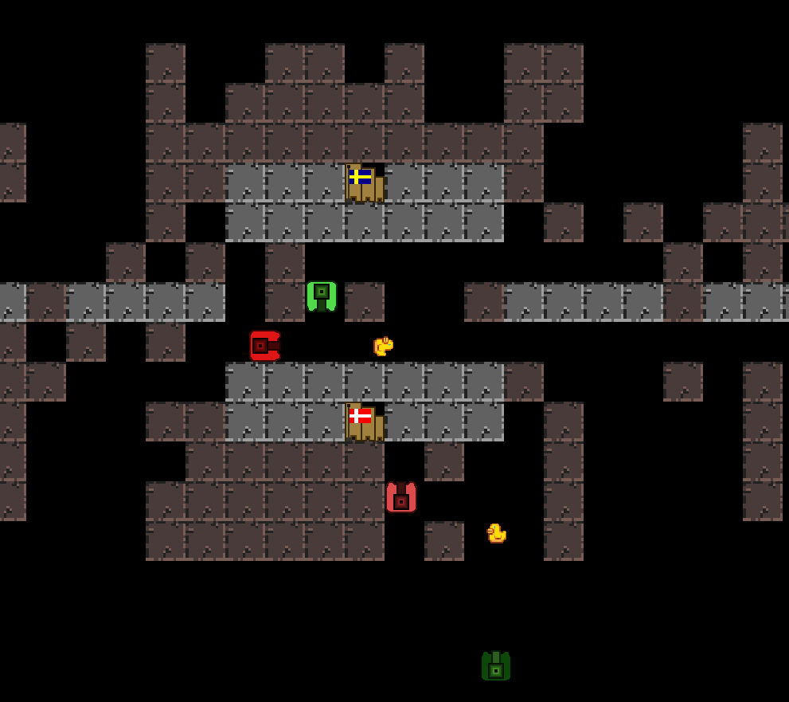

An action 2D game where you need to balance the act of defending your base while attacking the opponents at the same time.  

The game was made from scratch in **C++** with some help from **SFML**.  
Outside of creating the game itself, the project was an exercise in using common building blocks from Object-Oriented Programming such as inheritance and abstraction.

